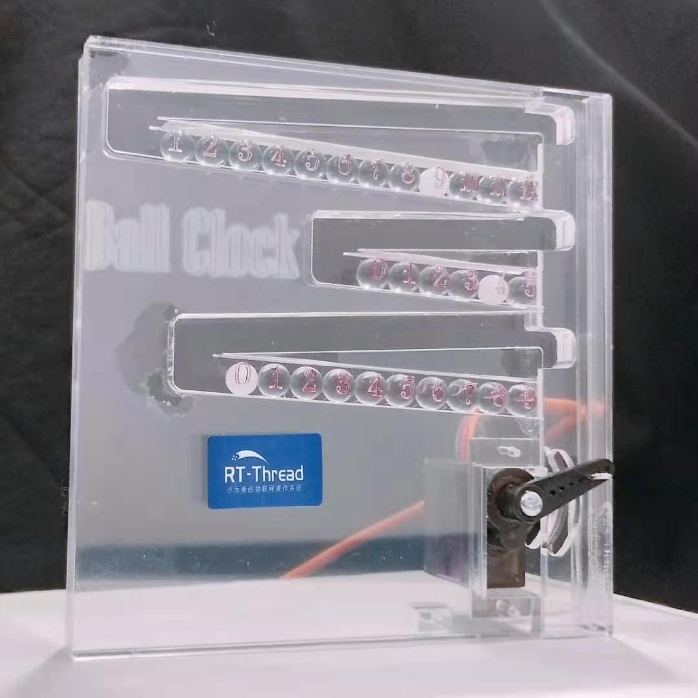
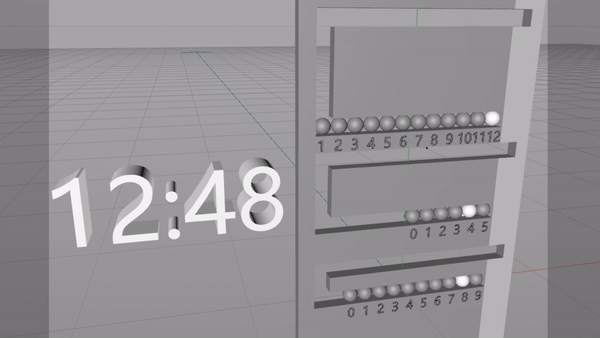
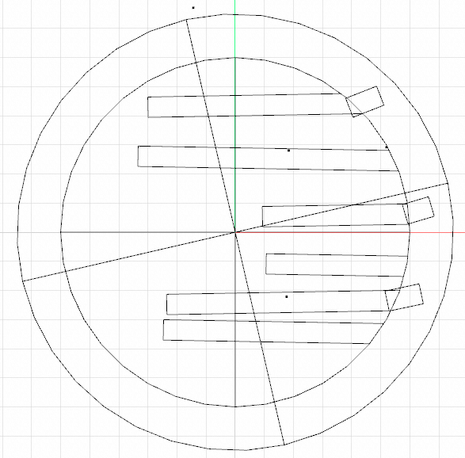
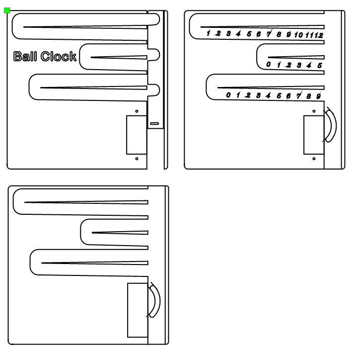
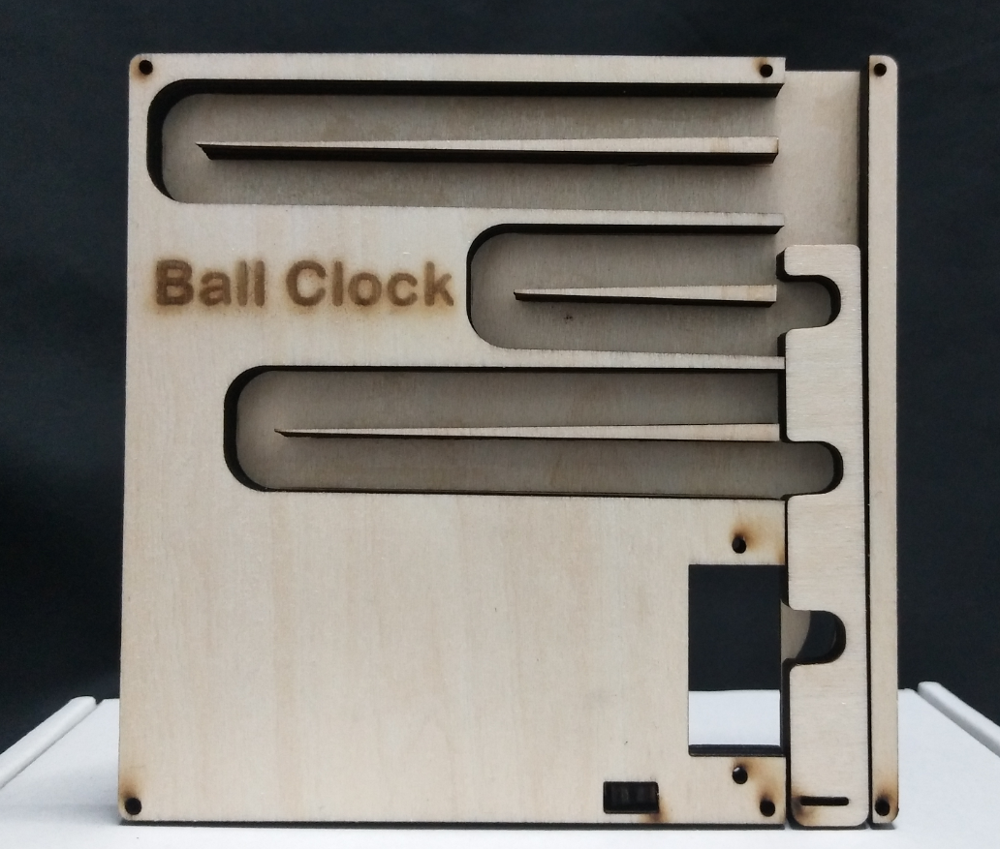
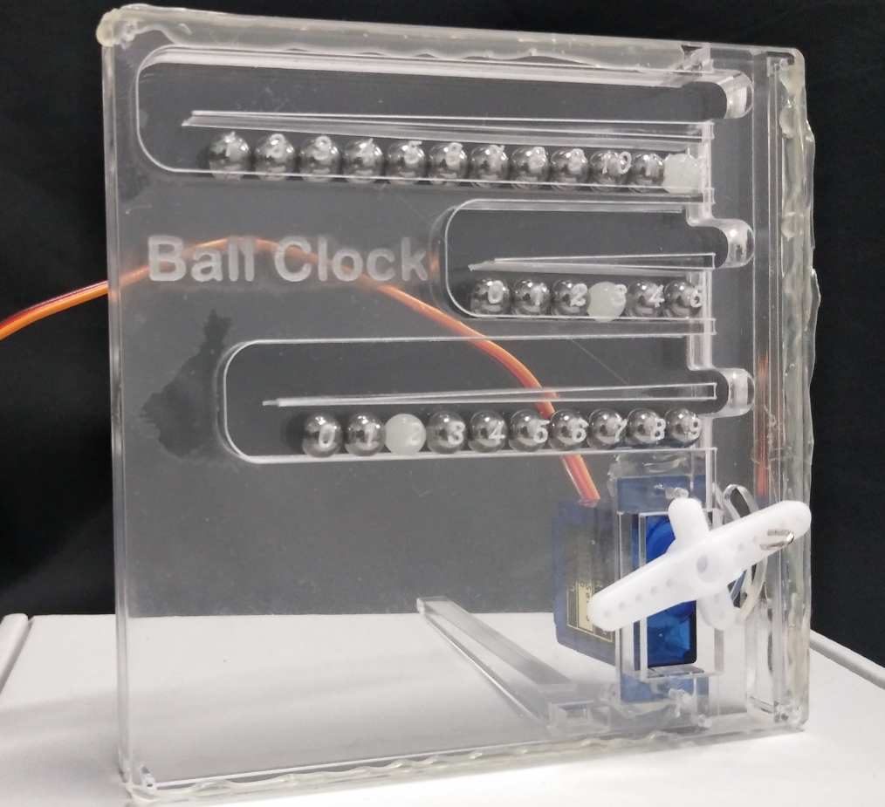
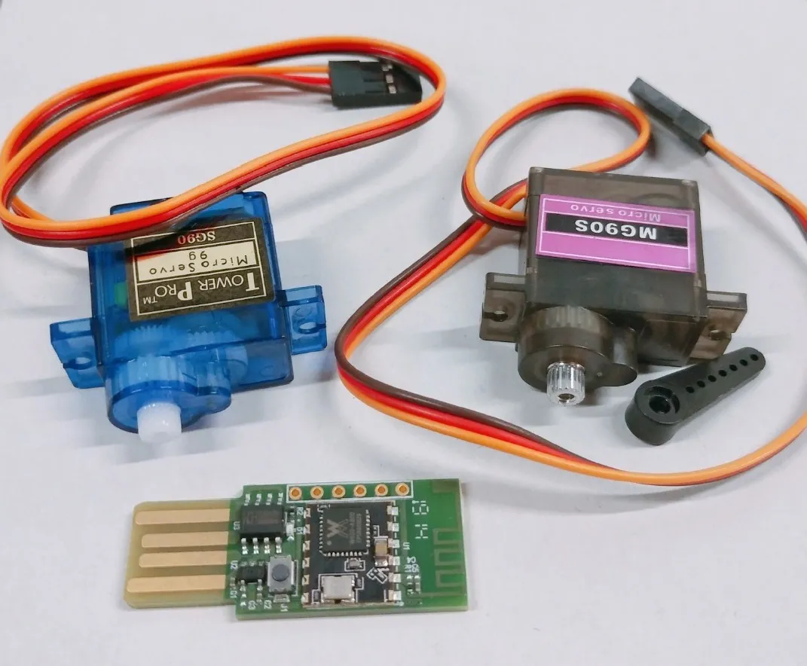
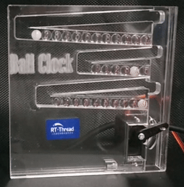

# 弹珠时钟 BallClock

## 一、缘起

生活节奏越来越快，有时候想要静心做点自己喜欢的事情，发现总是没有那么多的时间。习惯了快节奏的生活，有时一个起身才意识到时间过去了很久。

所以，我心里一直有个想法，希望时间可以被看见，能感受到它的流逝。终于有一天，我脑海里浮现了弹珠时钟的原型，便开始了尝试制作一款别样的时钟。

## 二、设计

最开始，我使用了C4D画了一个原型图，并且简单做了个动画，便于形象的认识到时钟的运行轨迹，以及机械结构。

但是初稿发现，这样的体积太大了，也很不友好，于是，开始了第二版的设计。我把原来的矩形，改为圆型，原来的滑块，变成了圆形的最外圈，这样，滑动起来，不会再多占用其它地方。甚至，最左边还有空余的地方，可以加上一个装饰小风车，当时间走动时，还可以带着风车转动……

然而，我的设计感完全不存在，尝试着修修改改，还是不满意，于是，只好作罢。

最终，我还是考虑做第三版，改回了最初的矩形。只是，尽量缩小上下之间的距离，让它看着不是那么的狭长。就这样修修改改，我得到了第三版的弹珠时钟。

怀着无比期待又忐忑的心情，我使用激光雕刻机雕刻了一版木制原型，确认相关位置和尺寸，发现还可以，心里悬着的石头放下了不少。

继续使用亚克力制作了一版，使用上弹珠和舵机，然后发现购买的亚克力厚度尺寸有些问题……之好用热熔胶临时顶上了，看着效果还不错！

不过，最终经过测试，我使用的是第四版……

## 三、调试

就这样，整体效果有了，我就开始了代码调试。

### 1、硬件

硬件非常简单，机械部分就是一个舵机，控制核心则是使用了飞思创的Air602，一款超小的WiFi板，上面主芯片是联盛德的W600。讲起这款芯片，不得不讲我之前制作的《桌面台历》也是基于这个芯片制作的。感兴趣的可以查看我这篇文章[【桌面台历基本定型啦！】](https://mp.weixin.qq.com/s/dkvEuGaUKihS8z9w--lYyQ)，或者，在B站搜索”[PCB台历](https://www.bilibili.com/video/BV1TJ411q7F3/)“，也可以看到（顺便给我B站账号：平头创意 求一波关注）

### 2、软件

软件部分，就更简单了，使用了国产物联网操作系统RT-Thread，一个文件，百行代码即可搞定。这里就不贴源码了，直接放到[GitHub](https://github.com/illusionlee/ballclock)，欢迎fork/pr。

## 四、效果

最上面的一行弹珠表示小时，中间的表示分钟的十位，下面的则是分钟的个位。白色的弹珠对应的数字就是当前的时间了。

看上去也没有那么的难理解吧。

## 五、结语

就这样，每分钟伴随着一次弹珠坠落的声音，倾诉着时间的流逝，提醒我专注于当下，切莫浪费时光。

